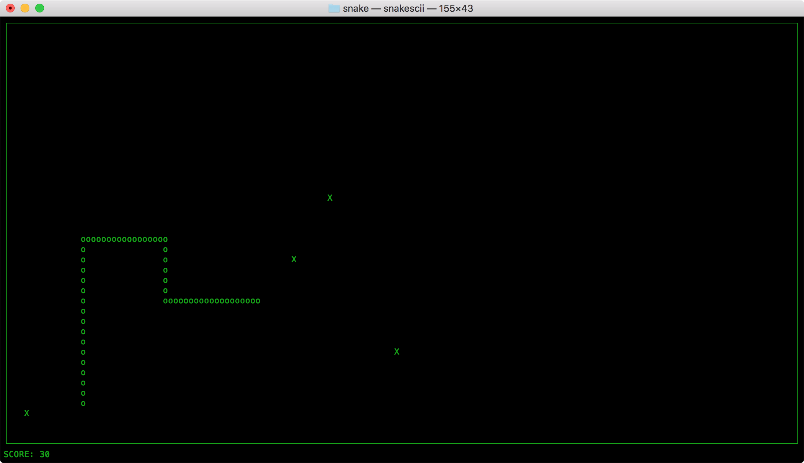

# Snakescii

A simple snake-like in ncurses

## Building

Run 'make' in snakescii directory

```
make
```

## Playing

Running in snakescii directory:

```
./snakescii
```

Use arrow keys to move the snake, press 'q' to quit. Collect snake food to raise your score

## Screenshot


